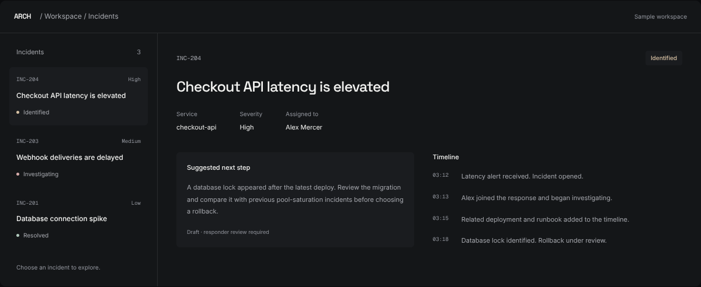

<div align="center">
  
  <h1>ARCH</h1>
  <p><strong>Less noise. More clarity.</strong></p>
  <p>A focused response workspace for engineering teams.<br />Bring alerts, context, and decisions together—on your own infrastructure.</p>
  <p>
    <a href="https://github.com/ssambit635-svg/ARCH/actions/workflows/ci.yml"></a>
    
    <a href="LICENSE"></a>
  </p>
  <p>
    <a href="#why-arch">Overview</a> ·
    <a href="#quick-start">Quick start</a> ·
    <a href="docs/README.md">Documentation</a> ·
    <a href="docs/api.md">API &amp; CLI</a> ·
    <a href="CONTRIBUTING.md">Contributing</a>
  </p>
</div>

<br />



<p align="center"><sub>Interactive landing-page preview. Illustrative data—not a live incident feed.</sub></p>

## Why ARCH

Production problems create enough noise. Your response tools shouldn’t add to it.

ARCH gives your team one place to understand what happened, coordinate the response, and keep a trustworthy record of the decisions that follow. It works alongside your monitoring tools and GitHub rather than replacing them.

- **A shared response.** Track incidents, assign responders, and collaborate through a continuous timeline.
- **Context close to the work.** Connect services, dependencies, changes, and runbooks to the investigation.
- **Assistance with boundaries.** Generate triage suggestions and drafts locally, then review them before they affect the incident.
- **Infrastructure you control.** Run the app, database, worker, and native inference in your own environment.

> **Release status:** Early access, **v0.3.0**. Evaluate ARCH in a private environment before relying on it for production response. Roadmap and pricing documents describe plans, not delivery or service-level guarantees.

## From first alert to the next lesson

```text
Investigating  →  Identified  →  Monitoring  →  Resolved
       shared context · responder decisions · continuous timeline
```

Forward transitions may skip ahead when appropriate. A resolved incident can be explicitly reopened; invalid transitions are rejected on the server.

| Capability | What you can do |
| :--- | :--- |
| **Incident workspace** | Search and filter incidents, manage severity and ownership, record comments and state changes. |
| **Alert intake** | Receive HMAC-signed webhooks, deduplicate deliveries, fingerprint incidents, and inspect delivery history. |
| **Native assistance** | Draft summaries, triage suggestions, customer updates, and postmortems using organization-scoped context. |
| **Knowledge & learning** | Retrieve relevant runbooks and similar incidents; train and evaluate per-organization classifiers. |
| **Service context** | Track dependencies, change events, and SLOs to support investigation. |
| **Code Assist & fix verification** | Review supplied code, inspect reproduction evidence, and review supported patch workflows before approving GitHub actions. |
| **Workspace chat** | Ask about your organization’s incidents and knowledge; manage your own conversations and memory. |
| **Customer communication** | Publish service health and incident history through public pages when enabled. |
| **Access & accountability** | Use organization-scoped workspaces, four server-enforced roles, audit logs, and scoped API tokens. |

### Native does not mean autonomous

ARCH’s engine uses small classifiers, TF-IDF similarity search, retrieval, rules, and templates. It is **not a general-purpose LLM**, and it does not need an external AI API key. Suggestions can be incomplete or wrong; useful results depend on the context and incident history you supply.

Copilot output is stored as a draft. A permitted responder reviews and approves it before it updates an incident or posts to its timeline. Native inference does not contact an AI vendor. Optional document fetching, GitHub, email, and other configured integrations can still use the network.

Read the [native engine guide](docs/engineering/ARCH-MODEL.md), [agent implementation notes](docs/engineering/ARCH-AGENT.md), and [AI guardrails](docs/engineering/AI-GUARDRAILS.md).

## Quick start

For authorized local development, use **Node.js 20.19+** and npm. Node.js 22 is used in CI. PostgreSQL can run through Docker or the embedded development fallback.

### 1. Get the code

```bash
git clone https://github.com/ssambit635-svg/ARCH.git
cd ARCH
npm ci
cp .env.example .env
chmod 600 .env
```

### 2. Configure your environment

Generate **two different secrets** and set them as `AUTH_SECRET` and `AUTH_SECRET_WEBHOOK` in your local `.env`:

```bash
openssl rand -base64 32
openssl rand -base64 32
```

The example already contains a local `DATABASE_URL` and `APP_URL`. Leave GitHub OAuth credentials blank unless you are enabling that integration. Do not commit `.env` or reuse production secrets locally.

### 3. Start ARCH

```bash
npm run dev
```

Open **[localhost:3000](http://localhost:3000)** and create an account at **`/register`**.

The development command generates the Prisma client, connects to PostgreSQL (or starts the local fallback), applies migrations, and starts Next.js. **No shared demo account is created.** Start `npm run worker` in another terminal if you want notification processing and scheduled model training.

The embedded database is for development and testing only. Its default data directory is under `/tmp`, and its process stops with the dev command. Use persistent, managed PostgreSQL for staging and production.

For Docker, custom database URLs, demo seeding, browser previews, and troubleshooting, see the [development guide](docs/DEVELOPMENT.md).

## Configuration

The full configuration contract is in [`.env.example`](.env.example).

| Variable | Purpose |
| :--- | :--- |
| `DATABASE_URL` | PostgreSQL connection URL. Use verified TLS for hosted databases. |
| `AUTH_SECRET` | Signs authentication sessions. Set a unique value for each environment. |
| `AUTH_SECRET_WEBHOOK` | Protects webhook endpoint credentials. Must differ from `AUTH_SECRET`. |
| `APP_URL` | Public app origin used for callbacks, invitations, and email links. |
| `AI_PROVIDER` | `arch` for native inference; `mock` for tests. No external provider adapter ships. |
| `ARCH_OFFLINE_ONLY` | Defaults to `true`; blocks public-URL knowledge fetching. It is not a firewall for all integrations. |
| `GITHUB_MODE` | `auto`, `mock`, or `real`. Real mode requires configured GitHub access. |

GitHub sign-in is optional. Follow the [OAuth setup guide](docs/GITHUB-OAUTH-SETUP.md) when enabling it. GitHub sign-in and repository write access are separate integrations.

## Built for a clear operating model

ARCH is a **modular monolith**: one Next.js application, one PostgreSQL database, and a separate worker for background processing. No Redis, vector service, or external AI runtime is required for native inference.

```text
Browser / CLI / signed webhook
              │
      Next.js App Router
              │
     Validation & permissions
              │
       Business services
              │
 Organization-scoped repositories
              │
          PostgreSQL
              ↕
    Notification & training worker
```

| Layer | Technology |
| :--- | :--- |
| Application | Next.js 16 · React 19 · strict TypeScript |
| UI | Tailwind CSS 4 · self-hosted fonts |
| Data | PostgreSQL · Prisma 7 · Zod |
| Authentication | Auth.js 5 · credentials and optional GitHub OAuth |
| Jobs | PostgreSQL-backed outbox and worker |
| Testing | Vitest · real, separate PostgreSQL test database |
| Terminal client | Python CLI in `clients/python` |

### Repository guide

```text
src/app/                    Pages, route handlers, and server actions
src/components/             Marketing, workspace, and shared UI
src/lib/                    Auth, configuration, permissions, validation
src/server/services/        Business rules and orchestration
src/server/repositories/    Organization-scoped database access
src/server/ai/              Native inference, retrieval, and guardrails
src/worker/                 Notification processing and model training
prisma/                     Schema and SQL migrations
clients/python/             Python CLI and its tests
scripts/                    Setup, database lifecycle, smoke tests, model tools
tests/                      Unit and database-backed integration tests
docs/                       Product, engineering, operations, and support guides
```

## Development & verification

```bash
npm run db:generate
npm run typecheck
npm test
npm run build
```

Tests provision their own PostgreSQL database on port `55433`, separate from development. CI also checks the production build, dependency audit, and Python CLI tests.

| Command | Use it for |
| :--- | :--- |
| `npm run dev` | Database preparation and local app development. |
| `npm run dev:next` | Next.js only, with an already running and migrated database. |
| `npm run db:migrate` | Apply SQL migrations to the configured database. |
| `npm run worker` | Drain notification jobs and run scheduled model training. |
| `npm run smoke:api` | Exercise the backend against a running app using disposable `smoke-*` data. |
| `npm run model:eval` | Evaluate the native model offline. |
| `npm run build` / `npm start` | Build and serve the production app; neither command migrates the database. |

Before deploying, configure durable PostgreSQL and unique secrets, set `APP_URL` to your public HTTPS origin, apply migrations, and run the app and worker as separately supervised processes. Review backups, mail delivery, TLS, and monitoring in the [operations runbook](docs/engineering/OPERATIONS-RUNBOOK.md).

## API & CLI

The beta bearer-token API lives under `/api/v1`. Tokens are organization-scoped and permission-scoped. Browser endpoints use the authenticated session; webhook ingestion uses a signature instead of a session.

```bash
pip install ./clients/python
arch login --url https://your-arch-host
arch incidents list
```

`arch login` prompts for the token without echoing it. Create a token as an owner or administrator and store it privately; do not pass credentials on a shared shell command line.

See the [API reference](docs/api.md), [CLI guide](clients/python/README.md), and [backend testing guide](docs/BACKEND-TESTING.md).

## Documentation

| You want to… | Start here |
| :--- | :--- |
| Understand the product | [Product overview](docs/EXPLAINED-SIMPLY.md) |
| Develop locally | [Development guide](docs/DEVELOPMENT.md) |
| Understand the architecture | [Architecture](docs/engineering/ARCHITECTURE.md) |
| Run and recover the service | [Operations runbook](docs/engineering/OPERATIONS-RUNBOOK.md) |
| Evaluate the native engine | [Model guide](docs/engineering/ARCH-MODEL.md) · [Guardrails](docs/engineering/AI-GUARDRAILS.md) |
| Test an early-access deployment | [Alpha testing](docs/ALPHA-TESTING.md) |
| Explore what is planned | [Roadmap](docs/product/ROADMAP.md) · [Changelog](CHANGELOG.md) |

The [documentation index](docs/README.md) covers the full library.

## Contributing & security

Read [CONTRIBUTING.md](CONTRIBUTING.md) and [AGENTS.md](AGENTS.md) before changing the code. Keep tenant authorization on the server, scope repository queries to the organization, validate external input, and test the failure paths as well as the happy path.

Report vulnerabilities through the private process in [SECURITY.md](SECURITY.md), not a public issue. Never include secrets, customer data, or private incident logs in bug reports.

## License

ARCH is **proprietary software**, not MIT-licensed or generally open source. Access to this repository does not grant permission to use, distribute, or commercialize it; see [LICENSE](LICENSE) for the current terms. Third-party assets retain their own licenses.

Legal documents in `docs/legal` are drafts and contain entity placeholders. They are not published customer commitments and require completion and legal review.

---

<p align="center"><sub>ARCH · A little less noise. A little more headspace.</sub></p>
